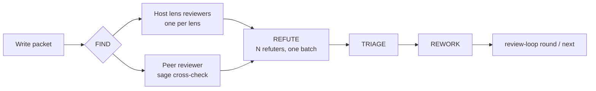

<!-- sage-doc-source: cross-review.md sha256:3f87580890b28c0452ee9e39c69ce5d3589c33440fd99a597c8ff37f4e834024 -->
# Phase 05 Review: Single Review and Cross Review

[한국어](cross-review.md) | [Documentation index](README.en.md)

Phase 05 shows the implementation to **a reviewer separated from its author**. SAGE does not ask the
working session to review itself; it starts the reviewer as a fresh headless process. Which reviewer
that is gives two modes.

| | Single review | Cross review (dual review) |
|---|---|---|
| Command | `sage review --packet-file F --host <active_host>` | `sage cross-check --packet-file F` |
| Reviewer | A **fresh session** of the runtime you are using (`claude -p` or `codex exec`) | **The opposite runtime** (claude host → `codex exec`, codex host → `claude -p`) |
| Enabled by | `options.cross_model: false`, or a local opt-out under a `recommended` policy | `options.cross_model: true` |
| What it filters out | The writing session's context and self-confidence | All of that, plus **biases a single model shares with itself** |
| Recorded mode | `REVIEWER_ACTUAL: same_runtime` | `REVIEWER_ACTUAL: cross_model` |

Cross review is also called "dual review" because in the review loop (Loop A) **the host's per-lens
reviewers and the opposite-runtime peer look for defects in the same round**. Single review has only
the host side.

## One round



- **FIND** — the host starts one reviewer per lens in `pdca.review_loop.lenses`. In cross review,
  `sage cross-check` starts the opposite-runtime peer once in the same round. In single review a
  fresh session of the same runtime (`sage review`) takes the peer's place.
- **REFUTE** — `refuters` reviewers judge **all** of the round's findings in one batch. A finding is
  dropped only when a strict majority refutes it; **a tie survives**. With `refuters: 2`, one refuter
  alone cannot drop a finding.
- **Peer-only P0/P1** — in cross review, a P0/P1 raised only by the peer is not dropped by host
  refuters alone. The refutation evidence goes into the next round's packet for the peer to re-judge;
  in the last round a human approves the drop.
- **Termination** — `sage review-loop next` recommends continue or stop deterministically from the
  recorded rounds and the settings (iteration cap, token budget, convergence).

## How the reviewer process starts

Both commands start the reviewer in **an empty working directory outside the repository** and let it
read the repository by absolute path. Project instructions that are injected from the working
directory (`CLAUDE.md`, `AGENTS.md`) and SAGE hooks therefore never reach the reviewer. The reviewer
receives only the packet and the **reviewer contract** SAGE prepends to it.

The reviewer contract is the same for every project.

- **Exploration budget** — draft a verdict from the packet first, then read only what a specific
  claim needs. At most 12 lookups; when the limit is reached, list what was not checked under
  `UNEXPLORED` and conclude. No re-reading rule documents, no running tests or builds, no sub-agents,
  no git history.
- **Output contract** — emit each finding as soon as it is confirmed, as its own `FINDING:` message.
  The final message carries the proposition verdicts, the full finding list, coverage, and the
  verdict line.

The controls applied at the process boundary differ by runtime. The two CLIs' enforcement options
point in opposite directions, so the goal is **the same limit**, not the same flags.

| | claude reviewer | codex reviewer |
|---|---|---|
| Shell and tests | `--restricted` removes the Bash family of tools entirely | The shell is its only tool and cannot be removed → test and build commands are classified afterwards and warned about |
| Sub-agents | Removed with `--disallowedTools Agent Task` | Cannot be disabled by configuration → found through session records, warned about, and added to usage |
| Settings and MCP | `--setting-sources=`, `--strict-mcp-config` | `-c mcp_servers={}`; configuration keys validated with `--strict-config` |
| Instruction injection | Empty working directory + `--add-dir` | `-c project_doc_max_bytes=0` + empty working directory |
| Web search | No tool | `-c web_search="disabled"` |
| Review model | `cross_model.reviewer.model` or the CLI default | Same; the user's `config.toml` is kept so the model does not change |

The control flags are applied from the verified minimum versions (claude 2.1.275, codex 0.155.1). When
a CLI is confirmed to be older, the reviewer runs without controls and reports
`REVIEWER_CONTROLS: none`. When the review ends by time limit, failure, or interruption, processes the
reviewer started are terminated with it. When the reviewer exits normally while a command it started in
the background is still running, macOS and Linux clean it up from the descendant list gathered during the
run; Windows has no such list, so the command can remain.

## The packet

The packet is what the reviewer judges from. It does not carry rule or plan documents verbatim; it
carries the items below. The full convention is the **Review packet** section of the installed
`docs/agent/review-protocol.md`.

- A summary of the review contract (verdict vocabulary, severity definitions)
- Phase 01 requirements and Phase 02 invariants rewritten as **true/false propositions**
- A **verification summary** of what Phase 03/04 already ran (so the reviewer does not rerun tests)
- The diff and the full body of every changed function
- A **context map** one hop out from the change (callers, callees, models and storage signatures as
  `file:line`)

Within a cycle, keep the packet body fixed and append each round's changes at the end. An unchanged
prefix keeps the reviewer's prompt cache warm.

## Output lines

Machine-readable `REVIEWER_*` lines follow the review body. Read the outcome **only from
`REVIEWER_STATUS`**; the other lines are detail.

| Line | Values |
|---|---|
| `REVIEWER_STATUS` | `COMPLETE` · `COMPLETE_DEGRADED` (fallback or control violation) · `PARTIAL` (cut off, findings kept) · `BLOCKED` |
| `REVIEWER_ACTUAL` | `cross_model` · `same_runtime` · `*_degraded`. Pass it to `review-loop close --reviewer-actual` |
| `REVIEWER_TOKENS` | Non-cached input `new_input`, cache reads `cached_input`, `output`, tool calls, wall clock. `measured=partial` when estimated for a cut-off run, `unknown` when not measured |
| `REVIEWER_CONTROLS` | `full` · `none` |
| `REVIEWER_AUDIT` | `ok` · `warn …` (a behavior that cannot be prevented was observed) · `violation …` (a behavior the controls should have prevented was observed → degraded) · `not_audited` |
| `REVIEWER_BLOCK_REASON` | Failure reason (table below) |

When `REVIEWER_ACTUAL` differs from the mode requested when the loop opened, the CI authority check
flags it as degraded. A fallback or a control violation therefore cannot pass as a cross review.

## When the reviewer fails

| `REVIEWER_BLOCK_REASON` | Meaning | Fallback allowed |
|---|---|---|
| `timeout` | Time limit exceeded; findings emitted so far are kept as `PARTIAL` | yes |
| `usage_limit` | The reviewer runtime's usage limit is exhausted | yes |
| `exit_nonzero` | Abnormal exit during the review | yes |
| `startup_failed` | Exited without emitting any event (authentication, configuration, …) | yes |
| `flags_rejected` | The CLI rejected SAGE's control flags (check the version) | no |
| `parse_failed` | The reviewer answered but the result could not be read (investigate) | no |
| `cli_missing` | The reviewer CLI is not installed | no |

The default is **BLOCKED**. To replace just that round with a same-runtime review, a human decides
and reruns `sage cross-check --on-peer-failure same-runtime`.

- The fallback runs once per round with half the original time limit. It never runs under
  `cross_model.policy: required`.
- The result is recorded as `REVIEWER_ACTUAL: same_runtime` and `REVIEWER_STATUS: COMPLETE_DEGRADED`
  and does not count as a cross review.
- The fallback is not a profile key on purpose: a committed policy file should not declare a
  standing relaxation, so the relaxation exists only as **that round's recorded decision**.

## Usage and budget

Pass the reviewer's measured usage verbatim when recording a round.

```bash
sage review-loop round --run-id $RUN_ID --iteration 2 \
  --found 3 --survived 3 --accepted 3 --tokens 260000 \
  --peer-tokens "new_input=83327 cached_input=586240 output=7744 tool_calls=9 wall_s=158"
```

- `--tokens` is the host's own cumulative estimate; `--peer-tokens` is the reviewer's measurement.
- The budget total is **the host's cumulative tokens plus each round's reviewer non-cached input and
  output**. Cache reads are recorded but not added, because how a provider counts them against its
  limits is unknown (they can be recalculated later).
- A round without a measurement (`unknown`) is not counted as zero; `next` and `close` warn about it.

## Measurements

Four metrics describe review cost: **non-cached input**, **reported input total** (including cache
reads), **wall clock**, and **tool calls**. Most reported input is the same context re-sent every
turn as cache reads, so a single total distorts the picture.

### ChatForYou — a cycle without reviewer controls

Codex reviewer measurements from an L3 bug-fix cycle that ran `pdca.review_loop` (4 lenses,
2 refuters, up to 3 rounds, a 600K-token budget) with cross review. Values are the sum of per-call
usage in the codex session records.

| Round | Cross review | Turns | Reported input | Of which cached | Non-cached input |
|---|---|---:|---:|---:|---:|
| 1 | Not run (usage limit) | — | — | — | — |
| 2 | Completed · found one P1 and one P2 | 30 | 4,021,233 | 3,833,344 (95.3%) | 187,889 |
| 3 | Exceeded the 540 s limit (main + sub-reviewer) | 28 + 21 | 6,546,491 | 6,199,168 (94.7%) | 347,323 |

- Round 2 took 8 min 32 s of wall clock and 29 tool calls.
- The non-cached input total (187,889) was about the size of the last turn's context: 95% of the
  4M reported input was the same content carried 30 times. Cost is roughly **turns × average
  context**, so it accelerates as turns grow.
- Classifying round 2's tool output: re-reading rule and meta documents (32%), re-reading plan
  documents (13%) and re-running tests (1%) contributed no defects. Both defects came from **looking up
  source outside the diff (53%)**. The design therefore does not forbid exploration; it cuts
  exploration unrelated to defects.

### SAGE 1.2.0 development — reviewing this feature with controlled reviewers

Measurements from reviewing this feature's own change (a 1,000–1,500-line diff, 90–140 KB packets)
with controlled reviewers. Values are `REVIEWER_TOKENS`.

| Review | Reviewer | Reported input | Non-cached input | Output | Tool calls | Wall clock |
|---|---|---:|---:|---:|---:|---:|
| Single #1 | claude (fresh session) | 106,239 | 49,298 | 7,734 | 2 | 88 s |
| Single #2 | claude (fresh session) | 170,299 | 51,076 | 7,599 | 3 | 88 s |
| Single #3 | claude (fresh session) | 254,148 | 61,464 | 12,059 | 7 | 132 s |
| Cross #1 | codex | 743,223 | 86,327 | 8,008 | 10 | 169 s |
| Cross #2 | codex | 669,567 | 83,327 | 7,744 | 9 | 158 s |
| Cross #3 | codex | 656,871 | 85,735 | 9,821 | 8 | 198 s |
| Cross #4 | codex | 512,117 | 78,709 | 7,090 | 7 | 151 s |

- No review spawned a sub-agent or ran tests (`REVIEWER_AUDIT: ok`).
- End-to-end runs with a small packet (one function with one defect) took about 28K tokens and 8 s
  for claude, and about 34K tokens and 14 s for codex.
- The two sets of measurements **use different code and packets and are not a like-for-like
  comparison**. The before/after comparison on the same code is a separate measurement that re-reviews
  the ChatForYou code as it was before round 2. Its acceptance criteria: find both defects round 2
  found, with at most 12 tool calls, 80K non-cached input, 1.2M reported input, and 5 minutes of wall
  clock. Meeting the cost targets while missing a defect counts as a failure.
