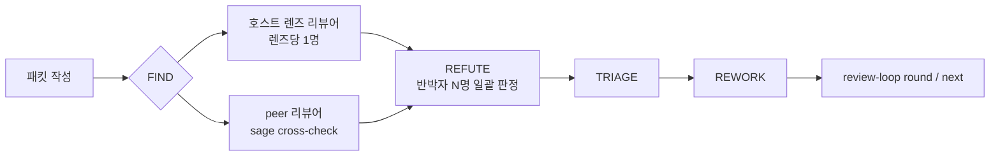

# Phase 05 리뷰: 단일 리뷰와 교차 리뷰

[English](cross-review.en.md) | [문서 인덱스](README.md)

Phase 05는 구현을 **작성자와 분리된 리뷰어**에게 보여 주는 단계입니다. SAGE는 리뷰어를 지금 작업 중인
세션 안에서 부르지 않고, 새 headless 프로세스로 띄웁니다. 그 리뷰어가 누구인지에 따라 두 방식이 있습니다.

| | 단일 리뷰 | 교차 리뷰 (이중 리뷰) |
|---|---|---|
| 명령 | `sage review --packet-file F --host <active_host>` | `sage cross-check --packet-file F` |
| 리뷰어 | 지금 쓰는 runtime의 **새 세션** (`claude -p` 또는 `codex exec`) | **반대 runtime** (claude host → `codex exec`, codex host → `claude -p`) |
| 켜는 설정 | `options.cross_model: false`, 또는 `recommended` 정책의 로컬 opt-out | `options.cross_model: true` |
| 걸러 내는 것 | 작성 세션의 맥락과 자기 확신 | 위에 더해 **한 모델이 공유하는 편향** |
| 기록되는 모드 | `REVIEWER_ACTUAL: same_runtime` | `REVIEWER_ACTUAL: cross_model` |

교차 리뷰를 "이중 리뷰"라고도 부르는 이유는, 리뷰 루프(Loop A)에서 **호스트의 렌즈별 리뷰어와 반대 runtime
peer가 같은 라운드에 함께 결함을 찾기** 때문입니다. 단일 리뷰는 호스트 쪽 리뷰만 있습니다.

## 한 라운드의 흐름



- **FIND** — 호스트는 `pdca.review_loop.lenses`의 렌즈마다 리뷰어를 하나씩 띄웁니다. 교차 리뷰면 같은
  라운드에 `sage cross-check`가 반대 runtime peer를 한 번 띄웁니다. 단일 리뷰면 peer 자리를 같은 runtime의
  새 세션(`sage review`)이 맡습니다.
- **REFUTE** — `refuters`명의 반박자가 이 라운드의 finding **전부를 한 번에** 판정합니다. finding은 반박 표가
  과반일 때만 기각되고, **동률이면 살아남습니다**. 그래서 `refuters: 2`에서는 반박자 한 명이 혼자 finding을
  버릴 수 없습니다.
- **peer만 찾은 P0/P1** — 교차 리뷰에서 peer만 지적한 P0/P1은 호스트 반박자만으로 기각하지 않습니다. 반박
  근거를 다음 라운드 패킷에 실어 peer가 다시 판단하게 하고, 마지막 라운드라면 사람이 승인합니다.
- **종료** — `sage review-loop next`가 기록된 라운드와 설정(반복 상한, 토큰 예산, 수렴)으로 계속할지 멈출지를
  결정론적으로 권고합니다.

## 리뷰어 프로세스는 이렇게 뜹니다

두 명령 모두 리뷰어를 **저장소 밖의 빈 작업 디렉터리**에서 띄우고, 저장소는 절대경로로 읽게 합니다. 작업
디렉터리 기준으로 자동 주입되는 프로젝트 지침(`CLAUDE.md`·`AGENTS.md`)과 SAGE hook이 리뷰어에게 들어가지
않습니다. 리뷰어가 받는 것은 패킷과, SAGE가 패킷 앞에 붙이는 **리뷰어 계약**뿐입니다.

리뷰어 계약은 모든 프로젝트에서 같습니다.

- **탐색 예산** — 패킷만으로 판정 초안을 먼저 쓰고, 특정 주장에 필요한 파일만 읽습니다. 조회는 12회까지이고,
  상한에 닿으면 못 본 곳을 `UNEXPLORED`로 적고 결론을 냅니다. 규칙 문서 재독, 테스트·빌드 실행, 하위
  에이전트 생성, git 히스토리 조회는 하지 않습니다.
- **출력 계약** — finding을 확인하는 즉시 `FINDING:`으로 하나씩 내보냅니다. 마지막 메시지에는 명제 판정,
  전체 finding, 커버리지, 판정 줄이 들어갑니다.

runtime마다 프로세스 경계에서 거는 통제가 다릅니다. 두 CLI의 강제 수단이 서로 반대 방향이라, 같은 플래그가
아니라 **같은 상한**을 목표로 합니다.

| | claude 리뷰어 | codex 리뷰어 |
|---|---|---|
| 셸·테스트 실행 | `--restricted`로 Bash 계열 도구 자체를 제거 | 셸이 유일한 도구라 제거할 수 없음 → 테스트·빌드 명령을 사후 분류해 경고 |
| 하위 에이전트 | `--disallowedTools Agent Task`로 제거 | 설정으로 막을 수 없음 → 세션 기록으로 찾아 경고하고 사용량에 합산 |
| 설정·MCP | `--setting-sources=`, `--strict-mcp-config` | `-c mcp_servers={}`, 설정 키는 `--strict-config`로 검증 |
| 문서 주입 | 빈 작업 디렉터리 + `--add-dir` | `-c project_doc_max_bytes=0` + 빈 작업 디렉터리 |
| 웹 검색 | 도구 없음 | `-c web_search="disabled"` |
| 리뷰 모델 | `cross_model.reviewer.model` 또는 CLI 기본값 | 같음. 사용자 설정(`config.toml`)은 유지해 모델이 바뀌지 않음 |

통제 플래그는 검증된 최소 버전(claude 2.1.275, codex 0.155.1) 이상에서 붙습니다. 그보다 낮다고
확인되면 통제 없이 실행하고 `REVIEWER_CONTROLS: none`으로 알립니다. 리뷰어가 띄운 하위 프로세스는 리뷰가
어떤 경로로 끝나든 함께 정리됩니다.

## 패킷

리뷰어가 판단하는 근거는 패킷입니다. 규칙·계획 문서 원문을 통째로 넣지 않고, 아래를 담습니다. 자세한 규약은
설치된 `docs/agent/review-protocol.md`의 **Review packet** 절에 있습니다.

- 리뷰 계약 요약 (판정 어휘, 심각도 정의)
- Phase 01 요구사항·Phase 02 불변식을 바꾼 **참/거짓 명제**
- Phase 03/04에서 이미 돌린 **검증 요약** (리뷰어가 테스트를 다시 돌리지 않게)
- diff와 변경된 함수의 전체 본문
- 변경 지점에서 한 단계 바깥까지의 **컨텍스트 지도** (호출자·피호출자·모델·저장소 시그니처를 `파일:라인`으로)

같은 사이클 안에서는 패킷 본문을 고정하고 라운드마다 바뀐 부분만 끝에 덧붙입니다. 앞부분이 같아야
리뷰어 쪽 프롬프트 캐시가 계속 맞습니다.

## 출력 줄

리뷰 본문 뒤에 기계가 읽는 `REVIEWER_*` 줄이 붙습니다. 결과는 **`REVIEWER_STATUS`로만** 판정하고, 나머지는
세부 정보입니다.

| 줄 | 값 |
|---|---|
| `REVIEWER_STATUS` | `COMPLETE` · `COMPLETE_DEGRADED`(폴백 또는 통제 위반) · `PARTIAL`(끊겼지만 찾은 finding 보존) · `BLOCKED` |
| `REVIEWER_ACTUAL` | `cross_model` · `same_runtime` · `*_degraded`. `review-loop close --reviewer-actual`로 넘깁니다 |
| `REVIEWER_TOKENS` | 캐시 밖 입력 `new_input`, 캐시 읽기 `cached_input`, `output`, 도구 호출, 벽시계. 끊긴 실행을 추정한 값이면 `measured=partial`, 측정 못 하면 `unknown` |
| `REVIEWER_CONTROLS` | `full` · `none` |
| `REVIEWER_AUDIT` | `ok` · `warn …`(막을 수 없는 행동 관측) · `violation …`(통제가 막았어야 할 행동 관측 → 강등) · `not_audited` |
| `REVIEWER_BLOCK_REASON` | 실패 사유 (아래 표) |

`REVIEWER_ACTUAL`이 루프를 열 때 요청한 모드와 다르면 CI 권한 검사가 강등으로 잡습니다. 그래서 폴백이나
통제 위반이 교차 리뷰로 위장되지 않습니다.

## 리뷰어가 실패하면

| `REVIEWER_BLOCK_REASON` | 뜻 | 폴백 대상 |
|---|---|---|
| `timeout` | 제한 시간 초과. 그때까지 나온 finding은 `PARTIAL`로 보존 | ○ |
| `usage_limit` | 리뷰어 runtime의 사용 한도 소진 | ○ |
| `exit_nonzero` | 리뷰 도중 비정상 종료 | ○ |
| `startup_failed` | 이벤트를 하나도 내지 못하고 종료 (인증·설정 등) | ○ |
| `flags_rejected` | CLI가 SAGE의 통제 플래그를 거부 (버전 확인 필요) | × |
| `parse_failed` | 리뷰어는 답했는데 결과를 읽지 못함 (원인 조사 대상) | × |
| `cli_missing` | 리뷰어 CLI가 설치돼 있지 않음 | × |

기본 동작은 **BLOCKED**입니다. 그 라운드만 같은 runtime 리뷰로 대신하려면 사람이 결정해서
`sage cross-check --on-peer-failure same-runtime`으로 다시 실행합니다.

- 폴백은 라운드당 1회, 제한 시간은 원래의 절반입니다. `cross_model.policy: required`에서는 폴백하지 않습니다.
- 결과는 `REVIEWER_ACTUAL: same_runtime`, `REVIEWER_STATUS: COMPLETE_DEGRADED`로 남아 교차 리뷰로 세지
  않습니다.
- 폴백 설정을 프로필 키로 두지 않은 이유는, 커밋되는 정책 파일에 상시 완화를 선언하지 않고 **그 라운드의
  기록된 결정**으로만 남기기 위해서입니다.

## 사용량과 예산

라운드를 기록할 때 리뷰어 실측값을 그대로 넘깁니다.

```bash
sage review-loop round --run-id $RUN_ID --iteration 2 \
  --found 3 --survived 3 --accepted 3 --tokens 260000 \
  --peer-tokens "new_input=83327 cached_input=586240 output=7744 tool_calls=9 wall_s=158"
```

- `--tokens`는 호스트 자신의 누적 추정치, `--peer-tokens`는 리뷰어 실측입니다.
- 예산 판정의 총량은 **호스트 누적 + 라운드별 리뷰어의 캐시 밖 입력과 출력의 합**입니다. 캐시 읽기는 제공자가
  한도에 어떻게 세는지 알 수 없어 합산하지 않고 기록만 남깁니다(나중에 다시 계산할 수 있습니다).
- 측정 못 한 라운드(`unknown`)는 0으로 세지 않고 `next`와 `close`가 경고합니다.

## 측정 결과

리뷰 비용을 판단할 때 쓰는 지표는 넷입니다: **캐시 밖 입력**, **보고 입력 합계**(캐시 읽기 포함),
**벽시계**, **도구 호출 수**. 보고 입력의 대부분은 같은 맥락을 턴마다 다시 실은 캐시 읽기라서, 하나의 합계만
보면 판단이 왜곡됩니다.

### ChatForYou — 리뷰어 통제가 없던 사이클

L3 버그 수정 사이클에서 `pdca.review_loop`(렌즈 4개, 반박자 2명, 최대 3라운드, 예산 60만 토큰)를 교차 리뷰로
돌렸을 때의 codex 리뷰어 측정입니다. 값은 codex 세션 기록의 호출별 사용량을 합산한 것입니다.

| 라운드 | 교차 리뷰 결과 | 턴 | 보고 입력 | 그중 캐시 | 캐시 밖 입력 |
|---|---|---:|---:|---:|---:|
| 1 | 사용 한도로 수행 못 함 | — | — | — | — |
| 2 | 완료 · P1 1건, P2 1건 검출 | 30 | 4,021,233 | 3,833,344 (95.3%) | 187,889 |
| 3 | 540초 제한 초과 (메인 + 하위 리뷰어) | 28 + 21 | 6,546,491 | 6,199,168 (94.7%) | 347,323 |

- 라운드 2의 벽시계는 8분 32초, 도구 호출은 29회였습니다.
- 캐시 밖 입력 총량(187,889)이 마지막 턴의 맥락 크기와 거의 같았습니다. 보고 입력 400만의 95%는 같은 내용을
  30번 다시 실어 나른 값이었습니다. 비용은 대략 **턴 수 × 평균 맥락**이라 턴이 늘수록 가속합니다.
- 라운드 2의 도구 출력을 분류하면, 규칙·메타 문서 재독 32%, 계획 문서 재독 13%, 테스트 재실행 1%는 결함
  검출에 기여하지 않았습니다. 결함 두 건은 모두 **diff 밖 소스 조회(53%)**에서 나왔습니다. 그래서 탐색을
  금지하지 않고, 결함과 무관한 탐색만 줄이는 쪽으로 설계했습니다.

### SAGE 1.2.0 개발 — 통제된 리뷰어로 이 기능 자체를 리뷰

이 기능의 변경분(diff 1,000~1,500줄, 패킷 9만~14만 바이트)을 통제된 리뷰어로 리뷰한 측정입니다. 값은
`REVIEWER_TOKENS`입니다.

| 리뷰 | 리뷰어 | 보고 입력 | 캐시 밖 입력 | 출력 | 도구 호출 | 벽시계 |
|---|---|---:|---:|---:|---:|---:|
| 단일 1회 | claude (새 세션) | 106,239 | 49,298 | 7,734 | 2 | 88초 |
| 단일 2회 | claude (새 세션) | 170,299 | 51,076 | 7,599 | 3 | 88초 |
| 단일 3회 | claude (새 세션) | 254,148 | 61,464 | 12,059 | 7 | 132초 |
| 교차 1회 | codex | 743,223 | 86,327 | 8,008 | 10 | 169초 |
| 교차 2회 | codex | 669,567 | 83,327 | 7,744 | 9 | 158초 |
| 교차 3회 | codex | 656,871 | 85,735 | 9,821 | 8 | 198초 |
| 교차 4회 | codex | 512,117 | 78,709 | 7,090 | 7 | 151초 |

- 모든 회차에서 하위 에이전트 생성과 테스트 실행은 0회였습니다(`REVIEWER_AUDIT: ok`).
- 작은 패킷(결함 하나가 든 함수)으로 한 종단 실행은 claude가 약 2.8만 토큰·8초, codex가 약 3.4만 토큰·14초였습니다.
- 두 측정은 **코드와 패킷이 달라 같은 조건의 비교가 아닙니다**. 통제 전후를 같은 코드로 비교하는 측정은
  ChatForYou의 라운드 2 직전 코드를 다시 리뷰하는 방식으로 따로 진행합니다. 그 측정의 수용 기준은, 라운드 2가
  찾은 두 결함을 그대로 찾으면서 도구 호출 12회 이하, 캐시 밖 입력 8만 이하, 보고 입력 120만 이하, 벽시계
  5분 이하입니다. 비용을 맞췄더라도 결함을 놓치면 실패로 봅니다.
